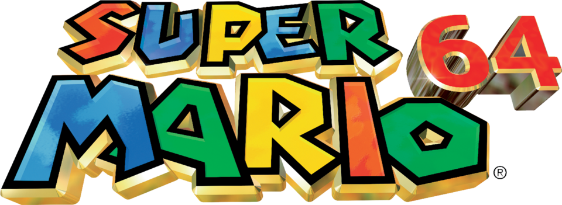
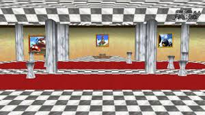
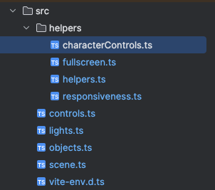
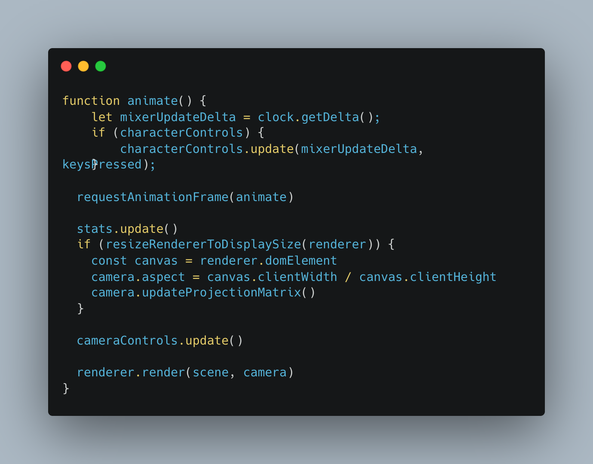
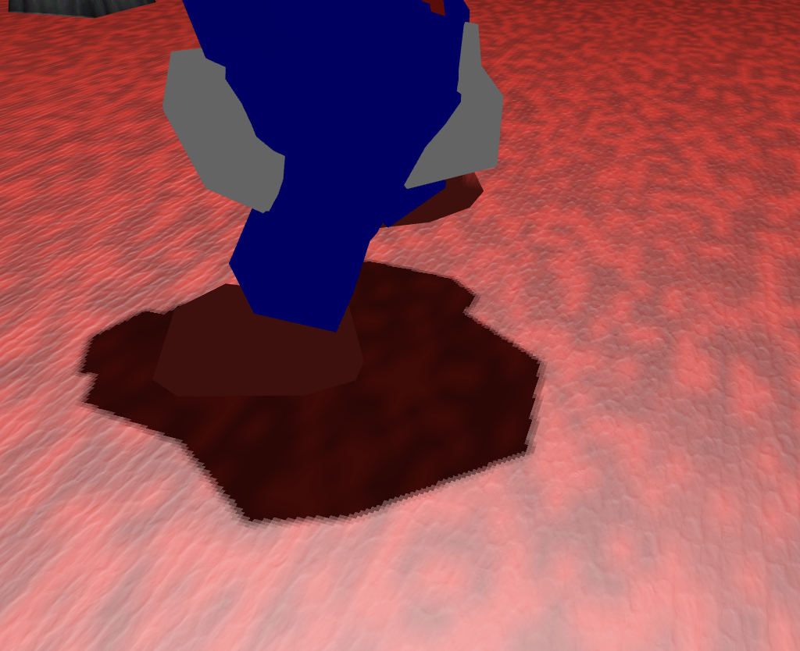
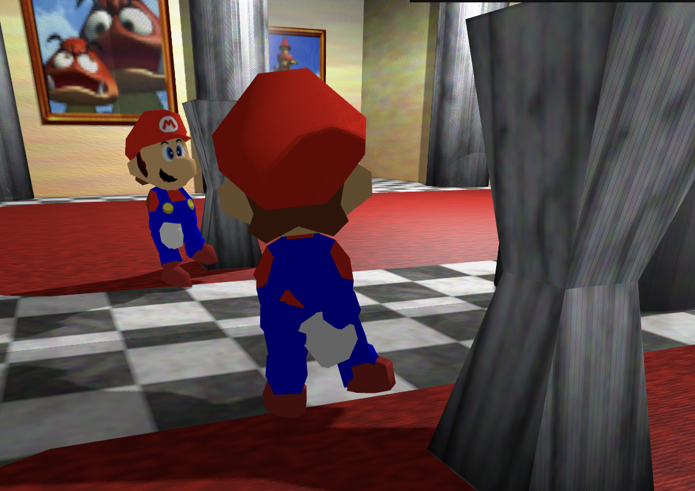
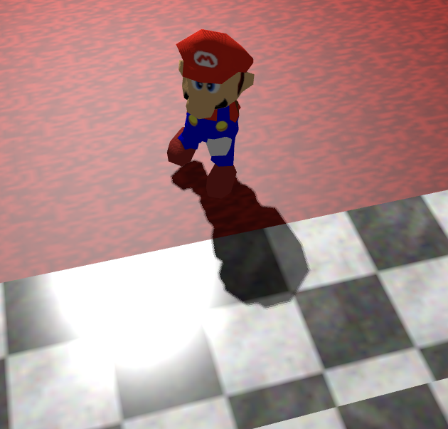
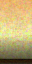
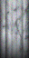
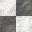

# Super Mario 64 Mirror Room - Three.js


Three.js/Vite project inspired by the mirror room from Super Mario 64. The application renders an interactive 3D room with an animated Mario model, reflective mirrors, textured materials, bump maps, shadows, keyboard controls, mobile touch controls, collision handling, loading feedback, and optional debug tools.

## Table of Contents

- [Overview](#overview)
- [Requirements](#requirements)
- [Installation](#installation)
- [Development](#development)
- [Build](#build)
- [Project Architecture](#project-architecture)
- [Interface](#interface)
- [Scene Controls](#scene-controls)
- [Scene Setup](#scene-setup)
- [Rendering](#rendering)
- [Animation](#animation)
- [Assets](#assets)
- [Documentation Media](#documentation-media)
- [Possible Improvements](#possible-improvements)
- [References](#references)

## Overview

The project is a browser-based interactive 3D scene built with HTML5, CSS, TypeScript, Vite, and Three.js. It recreates a compact Super Mario 64-style mirror room, with textured walls, floor, marble details, reflective surfaces, and an animated character model that can move around the room.

The goal is to provide a small but complete real-time graphics experience: models are loaded at runtime, materials are configured after loading, the renderer updates continuously, and the camera follows the character while still allowing the player to rotate the view.



## Requirements

- Node.js
- npm

## Installation

```bash
npm install
```

## Development

```bash
npm run dev
```

Then open the URL printed by Vite, usually:

```text
http://localhost:5173/
```

## Build

```bash
npm run build
```

The build runs TypeScript first and then creates the static Vite output in `dist/`. Runtime assets from `assets/` are copied into the build output so OBJ, MTL, texture, and GLB files remain available after deployment.

## Project Architecture

The project is organized around a small set of directories:

- `assets`: images, textures, OBJ/MTL files, and GLB files used by the scene.
- `style`: global CSS for the app, loading UI, information panels, and mobile controls.
- `src`: TypeScript source code for the scene, controls, objects, lights, helpers, and input handling.

TypeScript and Vite are used to keep the code structured, provide better editor feedback, and produce a deployable static build. The main scene file acts as the application orchestrator: it initializes the renderer, scene, camera, lights, UI, loaders, helpers, GUI, and animation loop.



```text
src/
  scene.ts                      Scene, renderer, GUI, input, loading UI, and loop setup
  input.ts                      Shared command configuration
  videoReference.ts             Mirror Room video reference metadata
  controls.ts                   Camera and OrbitControls setup
  objects.ts                    Room, mirror, and Mario loading
  lights.ts                     Scene lighting
  helpers/
    characterControls.ts        Movement, animation, collision, and camera following
    fullscreen.ts               Fullscreen toggle
    helpers.ts                  Three.js helpers
    responsiveness.ts           Renderer resize handling
  types/
    three-local.d.ts            Local type declarations for Three.js entrypoints
```

Each file has a focused responsibility:

- `characterControls.ts` manages Mario movement, animation state, collisions, and camera target updates.
- `fullscreen.ts` handles fullscreen transitions.
- `helpers.ts` initializes optional Three.js visual helpers such as the grid, axes, and light helpers.
- `responsiveness.ts` keeps the renderer in sync with the display size.
- `controls.ts` configures the camera and `OrbitControls`.
- `lights.ts` defines the scene lighting.
- `objects.ts` loads and configures the room, mirrors, and Mario model.
- `scene.ts` coordinates initialization and frame-by-frame rendering.

## Interface

The interface presents the 3D scene as the primary experience. A loading overlay reports asset progress, then fades when all managed assets are ready. Two expandable panels provide scene information and control hints. On desktop they open by default; on mobile they start closed to keep the viewport clear for the touch controller.


The app also includes:

- A debug GUI powered by `lil-gui`.
- A performance stats panel.
- A loading screen with the Super Mario 64 logo.
- A reference link for the mirror-room inspiration.
- A mobile controller with a joystick and action buttons.

## Scene Controls

Keyboard and mouse controls:

| Key | Action |
| --- | --- |
| W A S D | Move Mario relative to the camera |
| R | Toggle run/walk |
| Space | Jump |
| Arrow Down | Slide |
| M | Moonwalk |
| B | Dance |
| G | Show/hide debug GUI and FPS |
| Mouse | Rotate the camera |
| Double click on canvas | Toggle fullscreen |

Mobile touch controls:

| Control | Action |
| --- | --- |
| Joystick | Move Mario |
| Run | Toggle run/walk |
| Jump | Trigger jump animation |
| Slide | Trigger slide animation |
| Dance | Trigger dance animation |
| Moon | Trigger moonwalk animation |

When no movement or action is active, Mario returns to the `Idle` animation.

## Scene Setup

`scene.ts` contains the central initialization and rendering flow.

`init()` creates the full scene environment:

- Canvas and WebGL renderer.
- Three.js scene.
- Loading manager.
- Camera and orbit controls.
- Lights.
- Room, mirrors, and Mario model.
- Helpers.
- Stats panel.
- Debug GUI.
- Loading overlay and information panels.
- Mobile touch controls.

`animate()` runs once per frame. It updates the character controller, advances the animation mixer, resizes the renderer when needed, updates camera controls, and renders the scene.



## Rendering

### Shadows

Three.js simplifies shadow rendering compared with lower-level WebGL code. Meshes that should project shadows use `castShadow`, while meshes that should receive shadows use `receiveShadow`.

Enabling shadows across many meshes increases GPU work and can reduce frame rate. The scene therefore balances visual detail with performance by applying shadow settings where they are useful for the room and character presentation.

### Bump Maps

Bump maps add surface detail without increasing mesh complexity. The room uses additional bump textures for materials such as carpet, brick, wall, and marble, making flat geometry appear more tactile under lighting.



### Reflections

The mirrors use Three.js `Reflector`, an example object that renders a reflective surface by drawing the scene from a mirrored camera point of view. This keeps the room visually close to the original mirror-room inspiration and adds a clear rendering feature beyond basic mesh loading.



### Material Properties

Materials are adjusted after the MTL file loads. Different surfaces use different material properties according to their expected behavior: for example, marble can appear shinier and more reflective, while carpet uses lower reflectivity and a stronger bump texture.

Important properties include:

- `shininess`: controls the sharpness and strength of specular highlights.
- `reflectivity`: controls how much the material reflects incoming light.
- `bumpMap`: adds texture-driven surface detail.
- `bumpScale`: controls the intensity of the bump map effect.



## Animation

Mario animation is handled with Three.js `AnimationMixer`. The GLB model provides animation clips, which are mapped by name and played according to the current input state.

The controller separates continuous movement animations from one-shot actions:

- Continuous movement: `Walking`, `Walk Backward`, `Run`, `Moonwalk`.
- One-shot actions: `Jump`, `Slide`, `Dance`.
- Rest state: `Idle`.

When an action such as jump or dance starts, the animation is reset and allowed to finish before returning to the base movement or idle state. Transitions use short fade durations so changes between animations feel smoother.


## Assets

The mirror room was created in Blender and exported as OBJ/MTL files. Textures referenced by the MTL file live next to the model files in `assets/obj/mirror/`.

The Mario model is loaded as a GLB file from:

```text
assets/glb/SM64/SM64.glb
```

Room texture examples:







If assets are renamed or moved, update the paths in `src/objects.ts` and ensure the files are still copied to the production build.

## Documentation Media

The visual documentation is stored under `assets/docs/`. The README uses those files directly so the rendered documentation keeps the same visual support without broken relative paths.

| Topic | File |
| --- | --- |
| Scene preview | `assets/docs/images/SM64.png` |
| Mirror room reference | `assets/docs/images/mirror-room.jpeg` |
| Source folder structure | `assets/docs/images/src-2.png` |
| Application interface | `assets/docs/images/interfaccia-2.png` |
| Mobile interface | `assets/docs/images/interfaccia_mobile.png` |
| Animation loop code | `assets/docs/images/code/animate.png` |
| Scene setup code | `assets/docs/images/code/scene.png` |
| Rendering code | `assets/docs/images/code/render.png` |
| Mesh rendering code | `assets/docs/images/code/render_mesh.png` |
| Bump map example | `assets/docs/images/bump-map.png` |
| Mirror reflection | `assets/docs/images/specchio.png` |
| Material lighting | `assets/docs/images/materials-light.png` |
| Idle animation | `assets/docs/gifs/idle.gif` |
| Jump animation | `assets/docs/gifs/jump.gif` |
| Dance animation | `assets/docs/gifs/dance.gif` |

## Main Features

- OBJ/MTL mirror-room loading.
- GLB Mario model loading with animations.
- Camera-relative movement with `OrbitControls`.
- Keyboard and mobile touch controls.
- Room-boundary collision.
- Collision with the internal marble blocks.
- Smoother transitions between animation states.
- One-shot animations that finish before returning to the base movement state.
- Loading screen with asset progress.
- Super Mario 64 logo during loading.
- Expandable scene information and controls panels.
- Debug GUI and FPS stats hidden by default and toggled with `G`.
- Centralized command configuration in `src/input.ts`, reused by input handling and the on-screen legend.
- Smoothed camera target following Mario.
- Mirrors implemented with `Reflector`.

## Possible Improvements

- More precise collisions: generate colliders from scene meshes or use a lightweight physics library.
- More cinematic camera: add distance constraints and better wall-aware camera behavior.
- Cleaner architecture: split input, animation, collision, loading, and UI into smaller modules.
- More advanced one-shot animation events: chain actions and avoid unwanted loops while a key remains pressed.
- Audio: footsteps, jump sounds, collision sounds, and room ambience.
- Bundle optimization: code splitting or lazy loading for heavier 3D assets.
- Stronger Three.js typings: align dependencies and type packages around a single stable version.

## References

- [Three.js documentation](https://threejs.org/docs/)
- [Three.js AnimationMixer](https://threejs.org/docs/#api/en/animation/AnimationMixer)
- [lil-gui](https://lil-gui.georgealways.com/)
- [Three.js Reflector source](https://github.com/mrdoob/three.js/blob/dev/examples/jsm/objects/Reflector.js)
- [Mirror Room reference video](https://www.youtube.com/watch?v=fimWktqAC7s)
